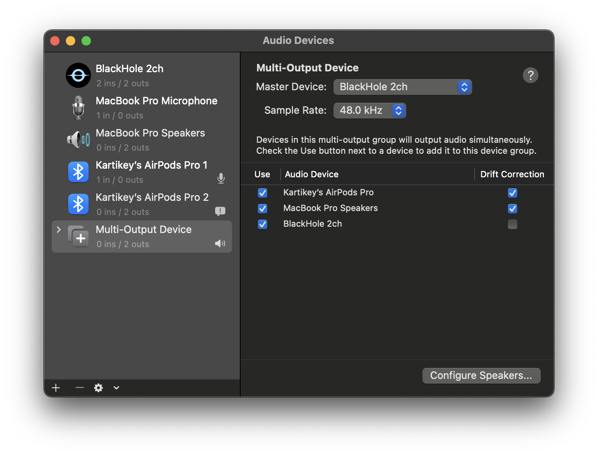

# BlackHole Channel Management

## Table of Contents

1. [Installation](#installation)
2. [Configutaions](#configurations)
    1. [1. Output](#1-output)
    2. [2. Input and Output](#2-input-and-output)
3. [FAQ](#faq)
    1. [1. Using AirPods Pro?](#1-using-airpods-pro)
    2. [2. Using MacBook Pro Speaker or MacBook Pro Microphone?](#2-using-macbook-pro-speaker-or-macbook-pro-microphone)
    3. [3. Renamed Device Not Displaying?](#3-renamed-device-not-displaying)
4. [Uninstall BlackHole](#uninstall-blackhole)
5. [References](#references)

## Installation

1. Download `brew` if you haven’t already

    ```bash
    /bin/bash -c "$(curl -fsSL https://raw.githubusercontent.com/Homebrew/install/master/install.sh)"
    ```

2. Use `brew` to install `blackhole-2ch`

    ```bash
    brew install blackhole-2ch
    ```

---

## Configurations

Below configurations have been tested for macOS Monterey Version 12.2.

### 1. Output

Use the below procedure if you want to output sound to multiple devices at a time.

1. Use Spotlight `command`+`space` and type `Audio Midi Setup`. Click on the Audio Midi Setup app to open
2. In the lower left hand corner of the `Audio Devices` click the `+` icon. Select `Create Multi-Output Device`
3. `Multi-Output Device` is created. Now select the `Audio Device`s in the list for `Use`
    1. Select the `MacBook Pro Speakers`
    2. Select the `AirPods Pro`
    3. Select `BlackHole 2ch`
4. Select `Master Device` as `MacBook Pro Speakers` or `BlackHole 2ch`. (Note: you shouldn’t select `AirPods Pro` as `Master Device` because AirPods run at lower sample rate)
5. Whichever `Audio Device`s you’ve selected under `Use`, enable their `Drift Correction` except the one for the `Master Device`
6. Right click on the `Multi-Output Device` from the left side list, and select `Use this device for sound output`
7. Change the output volume per device
    1. Select `MacBook Pro Speakers` from the left side list, change its `Channel Volume` → `Primary`

        Value → 0.5 (this differs based on how much you want to output)

    2. Select `AirPods Pro (0 ins / 2 outs)` from the left side list
        1. If you select `Format` → `1 ch 16-bit Integer 24.0 kHz`
            1. Change its `Channel Volume` → `Primary`
        2. If you select `Format` → `2 ch 32-bit Float 48.0 kHz`
            1. Change its `Channel Volume` → `1` and `2`

        Value → 0.4 (this differs based on how much you want to output)

8. Double click on the text `Multi-Output Device` from the left side list to rename it (optional)
9. Play any audio :)



---

### 2. Input and Output

Use the below procedure if you want to input audio from and output sound to multiple devices.

1. Use Spotlight `command`+`space` and type `Audio Midi Setup`. Click on the Audio Midi Setup app to open
2. In the lower left hand corner of the `Audio Devices` click the `+` icon. Select `Create Aggregate Device`
3. `Aggregate Device` is created. Now select the `Audio Device`s in the list for `Use`
    1. Select both of the listed `AirPods Pro`
    2. Select `BlackHole 2ch`
4. Select `Clock Source` as `MacBook Pro Microphone` or `BlackHole 2ch`. (Note: you shouldn’t select `AirPods Pro` as `Clock Source` because AirPods run at lower sample rate)
5. Whichever `Audio Device`s you’ve selected under `Use`, enable their `Drift Correction` except the one for the `Clock Source`
6. Right click on the `Aggregate Device` from the left side list, and select `Use this device for sound input`
7. Right click on the `Aggregate Device` from the left side list, and select `Use this device for sound output`
8. Change the input/output volume per device
    1. Select `BlackHole 2ch` from the left side list (this is what you’re currently inputting into the system), change its `Channel Volume` → `Primary`

        Value → 0.75 (this differs based on how much you want to output to `BlackHole 2ch`)

    2. Select `AirPods Pro (0 ins / 2 outs)` from the left side list (this is what you’re currently hearing)
        1. If you select `Format` → `1 ch 16-bit Integer 24.0 kHz`
            1. Change its `Channel Volume` → `Primary`
        2. If you select `Format` → `2 ch 32-bit Float 48.0 kHz`
            1. Change its `Channel Volume` → `1` and `2`

        Value → 0.45 (this differs based on your hearing power)

9. Double click on the text `Aggregate Device` from the left side list to rename it (optional)
10. Test :)
    1. Play any audio, start screen recording `command`+`shift`+`5`, under recording `Options` select `Microphone` → `Aggregate Device` or whatever you’ve renamed it to
    2. Start a meeting in Google Meet, select microphone and speaker as `Aggregate Device` or whatever you’ve renamed it to (Note: in this scenario, you can select your systems audio to default `AirPods Pro`)


---

## FAQ

### 1. Using AirPods Pro?

The microphone from AirPods Pro runs at a lower sample rate which means it should not be used as the primary/clock device in an Aggregate or Multi-Output device. The solution is to use your built-in speakers (and just mute them) or BlackHole 2ch as the primary/clock device. BlackHole 16ch will not work as the primary since the primary needs to have 2ch.

### 2. Using MacBook Pro Speaker or MacBook Pro Microphone?

Order of MacBook Pro Speaker or MackBook Pro Microphone must be at the top in the list of Audio Devices in both Aggregate or Multi-Output device. To reorder list, simply uncheck all devices and check by the order you want.

### 3. Renamed Device Not Displaying?

Restart CodeAudio

```bash
sudo launchctl kickstart -kp system/com.apple.audio.coreaudiod
```

---

## Uninstall BlackHole

1. Delete BlackHoleXch.driver by running

    ```bash
    sudo rm -R /Library/Audio/Plug-Ins/HAL/BlackHole2ch.driver
    ```

2. Restart CoreAudio with terminal command

    ```bash
    sudo launchctl kickstart -kp system/com.apple.audio.coreaudiod
    ```

---

## References

[https://github.com/ExistentialAudio/BlackHole](https://github.com/ExistentialAudio/BlackHole)
